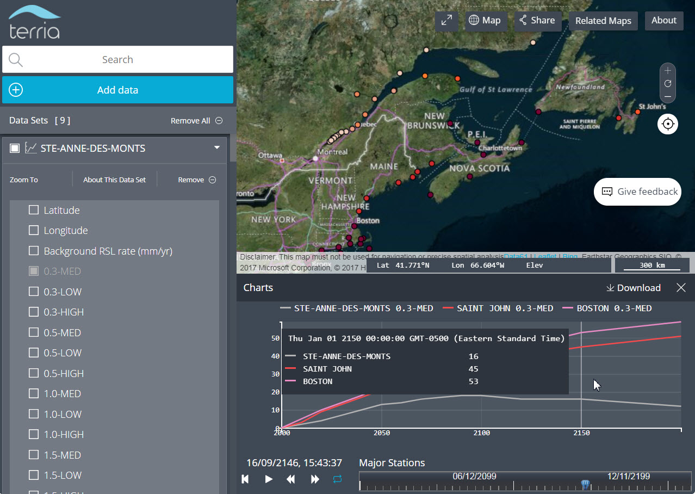

# TerriaJS experiments with the Sweet et al (2017) Sea Level Rise Data

* Watch [a 4 minute tutorial/demo](https://www.youtube.com/embed/sgw_Ux0cgtk)

* [View Major Stations](https://gamone.whoi.edu/terriajs/#clean&map=2d&proxy/_60s/https://raw.githubusercontent.com/rsignell-usgs/sweet_slr/master/sweet_major.json): loads quickly and probably what you want.  **Try selecting a scenario (e.g. "0.3-Med"), dragging the time slider, then clicking specific stations to see change with time.  Click "expand" and then select and "expand" more stations or scenarios to add to plot.**

* [View All Stations](https://gamone.whoi.edu/terriajs/#clean&map=2d&proxy/_60s/https://raw.githubusercontent.com/rsignell-usgs/sweet_slr/master/sweet_all.json):  loads slowly and is probably more than what you want
